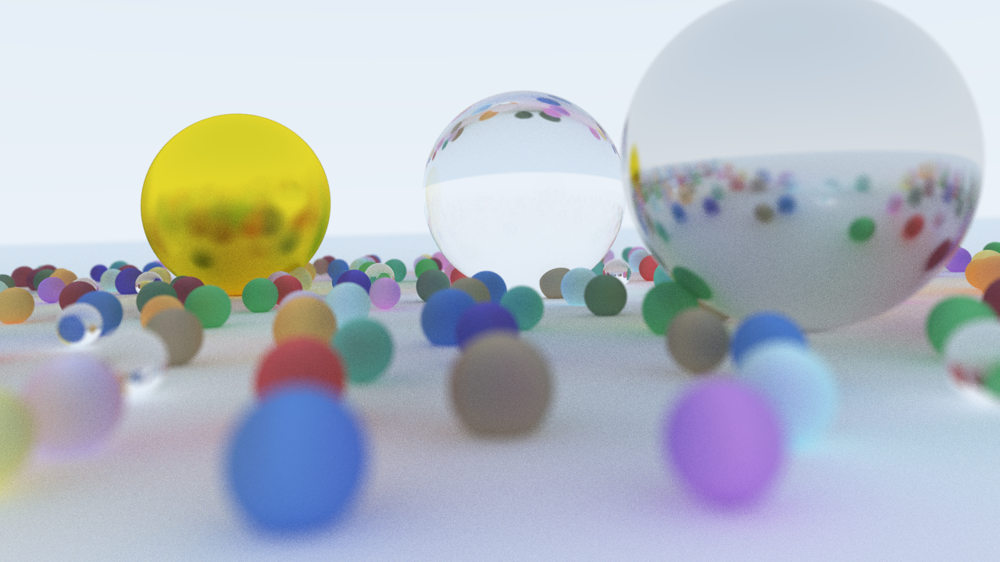

A ray-tracer built entirely from scratch, without any external libraries, in C++ based on the ["Ray Tracing in One Weekend"](https://raytracing.github.io/) trilogy of books by Peter Shirley.

# Results from the first book "Ray Tracing in One Weekend"

After working through the first of Peter Shirley's ray-tracing books, I've managed to create a decent looking little scene, similar to the cover of the book. I tried to incorporate every feature of the ray-tracer into this image as an easy way to see the current state of the application.

The features I have implemented for part one of this project are (in no particular order):
* Sphere-ray intersection and plane-ray intersection.
* Diffuse material with customizable colours.
* Metal material with both a colour and roughness property. The roughness controls how clear the reflections are in the object.
* Dialectric material (glass-like material) that refract light in addition to reflecting.
* A camera that can be set to an arbitray position, facing direction, roll, and field of view. As well as a simple lens implementation that mimics a depth-of-field effect with customizable aperture and focus distance parameters.
* A basic multi-threading implementation that batches scan lines together and runs the ray-tracing algorithm on the batches in parallel.
